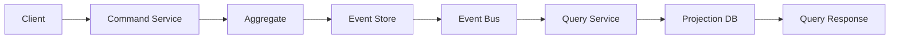

# CQRS & Event Sourcing Library Management System

## 📋 Project Overview

This project implements a comprehensive **Library Management System** using **CQRS (Command Query Responsibility Segregation)** and **Event Sourcing** patterns with **Axon Framework**. The system demonstrates advanced microservices architecture patterns through three progressive laboratories, each building upon the previous one to showcase different aspects of event-driven architecture.

## 🏗️ Architecture Pattern: CQRS & Event Sourcing

### What is CQRS?
**Command Query Responsibility Segregation (CQRS)** separates read and write operations into different models:
- **Command Side**: Handles business logic, validation, and state changes
- **Query Side**: Optimized for reading and reporting, often denormalized for performance

### What is Event Sourcing?
**Event Sourcing** stores all changes to application state as a sequence of events, providing:
- **Complete Audit Trail**: Every state change is recorded
- **Time Travel**: Ability to reconstruct state at any point in time
- **Event Replay**: Rebuild projections from historical events

## 🛠️ Technology Stack

### Core Framework
- **Java** - Primary programming language
- **Spring Boot** - Microservices framework
- **Axon Framework** - CQRS & Event Sourcing implementation
- **Axon Server** - Event Store and Message Routing

### Databases
- **MySQL** - Relational database for command and query sides
- **MongoDB** - Document database for materialized views (Lab 3)

### Communication
- **Event-Driven Messaging** - Asynchronous communication between services
- **REST APIs** - Synchronous communication for commands and queries

## 📚 Core API Components

### Commands
```java
- LibraryCreationCommand    // Create new library
- AddBookCommand           // Add book to library  
- RemoveBookCommand        // Remove book from library
- EditeurCreationCommand   // Create publisher/editor
```

### Events
```java
- LibraryCreatedEvent      // Library successfully created
- BookAddedEvent          // Book added to library
- BookRemovedEvent        // Book removed from library
- EditeurCreatedEvent     // Publisher/editor created
```

### DTOs (Data Transfer Objects)
```java
- LibraryDTO              // Library data representation
- BookDTO                 // Book data representation
- EditeurDTO              // Publisher/editor data representation
```

## 🧪 Laboratory Implementation

### Lab 1: Separate Command and Query Services

**Architecture**: Basic CQRS separation with stateless aggregates

#### Ms-Command-Library
- **Purpose**: Handle library creation and book management commands
- **Aggregate**: `LibraryAggregate` (stateless, no storage)
- **Business Rules**:
  - Not Null: [LibraryId, name, isbn]
  - Unique: ISBN must be unique within each library
- **Pattern**: Command-only service with event publishing

#### Ms-Query-Library  
- **Purpose**: Handle read operations and maintain query models
- **Entities**: Library, Book
- **Database**: `jdbc:mysql://localhost:3306/Query-Bdd`
- **Event Handlers**: Process events from command side
- **Features**: Repository pattern, projections for optimized queries

**Key Learning**: Separation of concerns between write and read models

---

### Lab 2: Materialized Join & State Stored Aggregates

**Architecture**: Introduction of state persistence and cross-service joins

#### Ms-Command-Editeur
- **Purpose**: Manage publisher/editor operations
- **Aggregate**: `EditeurAggregate` (state-stored with persistence)
- **Database**: `jdbc:mysql://localhost:3306/Editeur-bdd`
- **Features**: Full entity persistence, repository pattern, command controllers

#### Ms-Command-Library-Book
- **Purpose**: Enhanced library and book management
- **Aggregates**: 
  - `LibraryAggregate` (Aggregate Root)
  - `BookAggregate` (Aggregate Member)
- **Business Rules**: Enhanced validation with title requirements
- **Pattern**: Multi-aggregate command handling

#### Ms-Query-Library (Enhanced)
- **Purpose**: Materialized join queries
- **Feature**: `EditeurJoinBook` - Denormalized view combining publisher and book data
- **Database**: `jdbc:mysql://localhost:3306/Join-Query-Bdd`
- **Event Processing**: 
  - EditeurCreatedEvent
  - BookAddedEvent  
  - BookRemovedEvent

**Key Learning**: State persistence and cross-bounded context materialized views

---

### Lab 3: State Stored & MongoDB Integration

**Architecture**: Polyglot persistence with MongoDB for query optimization

#### Ms-Command-Library-Book-Stored
- **Purpose**: Fully persistent command handling
- **Aggregates**: State-stored Library and Book entities
- **Database**: `jdbc:mysql://localhost:3306/tp-cqrs-stored`
- **Features**:
  - Complete state persistence
  - Full CRUD operations
  - Command controllers with validation

#### Ms-Query-Join-Library-Book
- **Purpose**: NoSQL-optimized query service
- **Database**: `mongodb://localhost:27017/join-library-book`
- **Features**:
  - MongoDB document storage
  - MongoRepository pattern
  - Optimized projections for complex queries
- **Event Processing**: Real-time materialized view updates

**Key Learning**: Polyglot persistence and NoSQL optimization for queries

## 🚀 Getting Started

### Prerequisites
```bash
# Required Software
- Java 11+
- Maven 3.6+
- MySQL 8.0+
- MongoDB 4.4+
- Axon Server 4.5+
- Docker (optional)
```

### Axon Server Setup
```bash
# Download Axon Server
wget https://download.axoniq.io/axonserver/AxonServer.zip

# Extract and run
unzip AxonServer.zip
cd axonserver-*
java -jar axonserver.jar

# Access dashboard
http://localhost:8024
```

### Database Configuration

#### MySQL Databases
```sql
-- Create required databases
CREATE DATABASE `Query-Bdd`;
CREATE DATABASE `Editeur-bdd`;
CREATE DATABASE `Join-Query-Bdd`;
CREATE DATABASE `tp-cqrs-stored`;
```

#### MongoDB Setup
```bash
# Start MongoDB
sudo service mongod start

# Create database (automatically created on first use)
# Database: join-library-book
```

### Application Properties
```properties
# Axon Configuration
axon.axonserver.servers=localhost:8124

# MySQL Configuration
spring.datasource.url=jdbc:mysql://localhost:3306/{database-name}
spring.datasource.username=root
spring.datasource.password=your-password

# MongoDB Configuration (Lab 3)
spring.data.mongodb.uri=mongodb://localhost:27017/join-library-book
```

## 📡 API Endpoints

### Command APIs
```http
# Library Management
POST /api/commands/library/create
POST /api/commands/library/{libraryId}/books/add
DELETE /api/commands/library/{libraryId}/books/{bookId}

# Publisher Management  
POST /api/commands/editeur/create
```

### Query APIs
```http
# Basic Queries
GET /api/queries/libraries
GET /api/queries/libraries/{libraryId}
GET /api/queries/books
GET /api/queries/books/by-library/{libraryId}

# Materialized Views
GET /api/queries/editeur-join-books
GET /api/queries/library-book-join/{editeurId}
```

## 🔄 Event Flow Architecture

### Event Processing Flow


### Aggregate Lifecycle
1. **Command Reception** - Validate and process business command
2. **Business Logic** - Apply business rules and constraints
3. **Event Generation** - Create domain events representing state changes
4. **Event Persistence** - Store events in Axon Event Store
5. **Event Publishing** - Broadcast events to interested projections
6. **Projection Updates** - Update read models based on events

## 🛡️ Business Rules & Constraints

### Library Aggregate Rules
```java
// Validation Rules
- LibraryId: Cannot be null or empty
- Name: Required field, minimum 3 characters
- ISBN: Must be unique within library scope
- Title: Required for books (Labs 2-3)

// Business Constraints
- One ISBN per library (uniqueness constraint)
- Library must exist before adding books
- Book removal requires valid book ID
```

### Publisher/Editor Rules
```java
// Validation Rules
- EditeurId: Unique identifier required
- Name: Publisher name required
- Contact information validation

// Business Logic
- Publisher can be associated with multiple books
- Materialized join maintains referential integrity
```

## 📊 Data Models

### Command Side Models
```java
// Library Aggregate
public class LibraryAggregate {
    @AggregateIdentifier
    private String libraryId;
    private String name;
    private Set<String> isbns;
}

// Book Aggregate  
public class BookAggregate {
    private String isbn;
    private String title;
    private String libraryId;
}
```

### Query Side Models
```java
// Library Projection
@Entity
public class Library {
    @Id
    private String libraryId;
    private String name;
    @OneToMany
    private List<Book> books;
}

// Materialized Join (MongoDB)
@Document
public class EditeurJoinBook {
    private String editeurId;
    private String editeurName;
    private List<BookInfo> books;
}
```

## 🔧 Advanced Patterns Implementation

### Saga Pattern
```java
@Saga
public class LibraryBookSaga {
    
    @SagaOrchestrationStart
    @SagaStart
    public void handle(LibraryCreatedEvent event) {
        // Coordinate complex business processes
    }
    
    @SagaOrchestrationEnd
    public void handle(BookAddedEvent event) {
        // Complete saga workflow
    }
}
```

### Event Upcasting
```java
@Component
public class LibraryEventUpcaster extends SingleEventUpcaster {
    
    @Override
    protected boolean canUpcast(IntermediateEventRepresentation intermediateRepresentation) {
        return "LibraryCreatedEvent".equals(intermediateRepresentation.getType().getName())
               && intermediateRepresentation.getType().getRevision().equals("1.0");
    }
}
```

### Snapshot Strategy
```java
@Component
public class LibrarySnapshotTriggerDefinition implements SnapshotTriggerDefinition {
    
    @Override
    public Snapshotter prepareTrigger(Class<?> aggregateType) {
        return AggregateSnapshotter.builder()
                .eventCountSnapshotTriggerDefinition(50) // Snapshot every 50 events
                .build();
    }
}
```

## 🧪 Testing Strategy

### Unit Testing
```java
// Aggregate Testing
@Test
void shouldCreateLibraryWhenValidCommand() {
    // Given
    LibraryCreationCommand command = new LibraryCreationCommand("lib1", "Central Library");
    
    // When & Then
    ResultValidator.expectEvents(LibraryCreatedEvent.class)
                  .andExpectState(state -> assertThat(state.getName()).isEqualTo("Central Library"));
}
```

### Integration Testing
```java
// Event Processing Testing
@Test
void shouldUpdateProjectionWhenBookAdded() {
    // Given
    commandGateway.sendAndWait(new AddBookCommand("lib1", "978-0134685991", "Effective Java"));
    
    // When
    await().atMost(5, SECONDS).until(() -> 
        bookRepository.findByLibraryId("lib1").size() == 1
    );
    
    // Then
    List<Book> books = bookRepository.findByLibraryId("lib1");
    assertThat(books.get(0).getIsbn()).isEqualTo("978-0134685991");
}
```

## 📈 Performance Considerations

### Query Optimization
- **Materialized Views** - Pre-computed joins for fast reads
- **MongoDB Indexing** - Optimized document queries
- **Event Store Partitioning** - Distributed event storage

### Scalability Patterns
- **Read Replicas** - Multiple query service instances
- **Event Replay** - Rebuild projections independently
- **Command Scaling** - Horizontal aggregate scaling

## 🚀 Deployment Architecture

### Docker Compose Setup
```yaml
version: '3.8'
services:
  axon-server:
    image: axoniq/axonserver:latest
    ports:
      - "8024:8024"
      - "8124:8124"
  
  mysql:
    image: mysql:8.0
    environment:
      MYSQL_ROOT_PASSWORD: password
    ports:
      - "3306:3306"
  
  mongodb:
    image: mongo:4.4
    ports:
      - "27017:27017"
```

### Kubernetes Deployment
```yaml
apiVersion: apps/v1
kind: Deployment
metadata:
  name: library-command-service
spec:
  replicas: 3
  selector:
    matchLabels:
      app: library-command
  template:
    spec:
      containers:
      - name: library-command
        image: library-management/command-service:latest
        env:
        - name: AXON_SERVER_URL
          value: "axon-server:8124"
```

## 🔍 Monitoring & Observability

### Axon Dashboard Metrics
- **Event Store Statistics** - Event processing rates
- **Command Handling** - Success/failure rates  
- **Query Performance** - Response time metrics
- **Aggregate Health** - State consistency checks

### Application Monitoring
```java
// Custom Metrics
@EventHandler
public void on(BookAddedEvent event) {
    meterRegistry.counter("books.added", "library", event.getLibraryId()).increment();
    projectionService.updateBookProjection(event);
}
```

## 🐛 Troubleshooting

### Common Issues
1. **Event Store Connection** - Verify Axon Server is running on port 8124
2. **Projection Updates** - Check event handler registration
3. **Command Validation** - Verify aggregate state before command execution
4. **Database Connectivity** - Ensure MySQL/MongoDB connections are active

### Debugging Tools
```bash
# Check Axon Server status
curl http://localhost:8024/actuator/health

# View event store contents
curl http://localhost:8024/v1/events/{aggregateId}

# Monitor command processing
curl http://localhost:8024/v1/commands/statistics
```

## 🎓 Learning Objectives

### Lab 1 Outcomes
- ✅ Understand CQRS separation of concerns
- ✅ Implement stateless aggregate pattern
- ✅ Master event-driven communication

### Lab 2 Outcomes  
- ✅ State persistence in aggregates
- ✅ Cross-service data materialization
- ✅ Complex event processing patterns

### Lab 3 Outcomes
- ✅ Polyglot persistence strategies
- ✅ NoSQL optimization for queries  
- ✅ Advanced projection patterns

## 🔄 Migration & Evolution

### Schema Evolution
```java
// Event versioning strategy
@EventVersion("2.0")
public class LibraryCreatedEvent {
    // New fields added in version 2.0
    private String description;
    private LocalDateTime createdAt;
}
```

### Backward Compatibility
- **Event Upcasting** - Transform old events to new format
- **Parallel Processing** - Run old and new projections simultaneously
- **Gradual Migration** - Phase out old event versions

## 📄 Project Benefits

### Business Benefits
- **Audit Trail** - Complete history of all changes
- **Scalability** - Independent scaling of read/write operations
- **Flexibility** - Easy addition of new query models
- **Reliability** - Event replay for disaster recovery

### Technical Benefits
- **Separation of Concerns** - Clear command/query boundaries
- **Performance** - Optimized read models for different use cases
- **Maintainability** - Modular microservices architecture
- **Testability** - Event-driven testing strategies

This project serves as a comprehensive learning platform for understanding advanced enterprise patterns in distributed systems, providing hands-on experience with CQRS, Event Sourcing, and modern microservices architecture.
